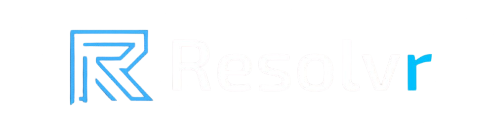
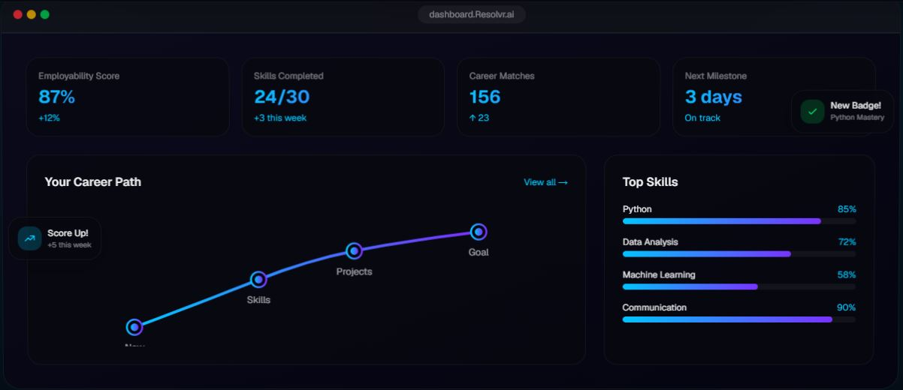
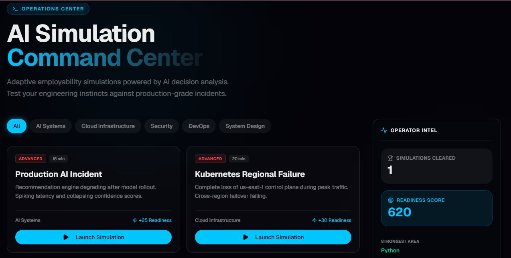
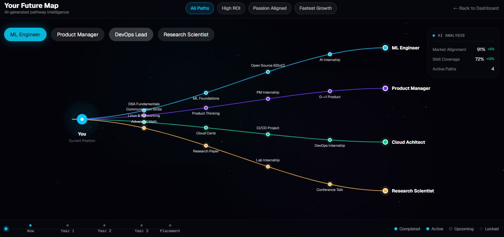
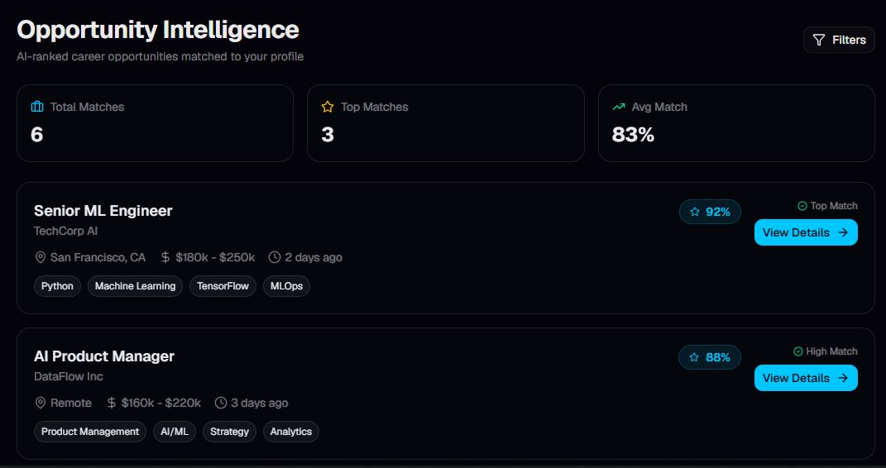

<div align="center">



<br/>


<br/>

[](https://nextjs.org/)
[](https://react.dev/)
[](https://www.typescriptlang.org/)
[](https://tailwindcss.com/)
[](https://resolvr-lac.vercel.app)
&nbsp;&nbsp;

<br/>

[](https://github.com/tanayjdev/Resolvr)

</div>

<br/>


---

## 🎯 What is Resolvr?

> **Students don't fail to get jobs because they lack degrees. They fail because they've never debugged a production Kubernetes outage at 2am.**

Resolvr puts you inside that moment — before it matters. You pick a career goal, get a real readiness score, and work through actual P0/P1 production incidents in a live terminal. Every command you run, every hint you take, every escalation you handle (or miss) updates your employability score in real time.

**No static quizzes. No fake career advice. Real incident scenarios, real skill gaps, real paths forward.**

<br/>

---

## ✨ Platform at a Glance

<div align="center">

| | Feature | What it does |
|:---:|:---|:---|
| 🧠 | **AI Readiness Engine** | Scores you 0–100 based on skill level, simulations completed, pathway progress, and skill-interest alignment |
| ⚡ | **Incident Simulations** | 5 production-grade scenarios — type real `kubectl`, `systemctl`, `curl` commands in a live terminal |
| 🧭 | **Career Pathways** | ML → Cybersecurity → Cloud → Frontend — adaptive roadmap that unlocks as your score grows |
| 🔍 | **Skill Gap Analysis** | Current vs target proficiency per skill, with AI-generated improvement actions |
| 💼 | **Opportunity Matching** | AI-ranked internships and roles scored against your actual skill profile |
| 📈 | **Progress Analytics** | Timeline of milestones, AI confidence, recommendation strength over time |

</div>

<br/>

---

## ⚡ Simulation Engine

The core of the platform. Five production-grade incidents, each running through 4 stages:

```
IDENTIFY  ──▶  DIAGNOSE  ──▶  RESOLVE  ──▶  DOCUMENT
```

You get a live terminal. Real logs streaming. An AI co-pilot watching your moves.

<br/>

<div align="center">

### 🔴 Active Scenarios

| Severity | Scenario | The Situation |
|:---:|:---|:---|
|  | **Kubernetes Regional Failure** | us-east-1 control plane down. Etcd quorum lost — 2/3 nodes unreachable. 40% error rate. Failover breaking. |
|  | **CI/CD Pipeline Meltdown** | Build times +400%. 200 jobs queued. All runners exhausted. Security hotfix blocked in queue. |
|  | **Production AI Incident** | Rec engine latency p99 > 2400ms post-rollout. Confidence scores collapsing. Conversion dropping live. |
|  | **Recommendation Engine Drift** | 15% conversion drop over 72h traced to embedding space drift. Model accurate — business metrics not. |
|  | **Security Token Breach** | GitHub admin token leaked. 500+ API calls/hour. Active exfiltration. Every second costs. |

</div>

<br/>

### 🎮 How Scoring Works

Every action you take changes your score (0–1000 scale):

```
✅  Step completed correctly    +50 pts
✅  Escalation handled          +40 pts
⏱️  Time bonus (per min left)   +2  pts
❌  Hint used                   -10 pts
❌  Step skipped                -30 pts
❌  Escalation missed           -25 pts
```

Score feeds directly back into your **Readiness Score** — completing simulations is the fastest way to level up.

<br/>

---

## 🧠 Readiness Score Formula

Your employability score (0–100) is computed deterministically from `lib/readiness-engine.ts`:

<div align="center">

| Input | Points |
|:---|:---:|
| Skill level — Beginner | 20 |
| Skill level — Intermediate | 45 |
| Skill level — Advanced | 65 |
| Each simulation completed | +8 |
| Every 10% of pathway progress | +2 |
| Each matched skill–interest pair | +2 |

</div>

Score updates in real time. No black box — you always know exactly how to move it.

<br/>

---

## 🧭 Career Pathways

Four pathways, each a structured roadmap from **Foundation → Intermediate → Specialization**:

<div align="center">

| Pathway | For | Unlocked by |
|:---|:---|:---|
| 🤖 Machine Learning | AI Engineer, Data Scientist | Default for AI/ML goal |
| 🔐 Cybersecurity | DevOps Engineer | Default for DevOps goal |
| ☁️ Cloud Computing | Cloud Engineer | Default for Cloud goal |
| 💻 Frontend Engineering | Backend Developer | Default for Backend goal |

</div>

Nodes lock/unlock based on your readiness score threshold — finishing simulations is what moves the path forward.

<br/>

---

## 🚶 Onboarding Flow

Five steps. Two minutes. Fully personalized experience unlocked.

<div align="center">

| Step | Question | Options |
|:---:|:---|:---|
| 1 | Career Goal | AI Engineer / Data Scientist / Backend Developer / Cloud Engineer / DevOps Engineer |
| 2 | Interests | Machine Learning / System Design / Cloud / Cybersecurity / Web Development / Data Analytics |
| 3 | Skill Level | Beginner (20 pts) / Intermediate (45 pts) / Advanced (65 pts) |
| 4 | Learning Style | Hands-on Simulations / Video Learning / Projects / Mentorship |
| 5 | Weekly Commitment | 2 hrs / 5 hrs / 10 hrs+ |

</div>

<br/>

---

## 🔄 How Data Flows

```
  Onboarding (5 steps)
       │
       ▼
  UserProfile  ──────────────────────────────────────────────────┐
       │                                                         │
       ▼                                                         │
  computeReadinessScore()  →  score: 0–100                       │
       │                                                         │
       ▼                                                         │
  pathway-engine  →  CareerPathway + locked/unlocked nodes       │
       │                                                         │
       ▼                                                         │
  Simulations + Opportunities + Skill gaps (all adaptive)        │
       │                                                         │
       ▼                                                         │
  User completes simulation  →  score deltas applied  ───────────┘
                                  (loop repeats, score grows)
```

State lives in two React contexts — `UserContext` (profile + progress) and `AppStateContext` (active sim run, filters, notifications) — both persisted to `localStorage`.

<br/>

---

## 🗂️ Project Structure

```
resolvr/
├── app/                        # Next.js App Router pages
│   ├── page.tsx                # Landing page
│   ├── layout.tsx              # Root layout
│   ├── dashboard/              # Main dashboard
│   ├── onboarding/             # 5-step onboarding flow
│   ├── pathway/                # Career pathway explorer
│   ├── simulation/             # Single simulation runner
│   ├── simulations/            # Simulation browser
│   ├── opportunities/          # Opportunity intelligence
│   ├── readiness/              # Readiness score & analytics
│   ├── skills/                 # Skill gap analysis
│   ├── recommendations/        # AI recommendations
│   ├── settings/               # User settings
│   └── team/                   # Team page
│
├── components/
│   ├── landing/                # Hero, navbar, features, CTA, footer
│   ├── dashboard/              # Widgets, pathway graph, stats panels
│   ├── simulation/             # Terminal, live logs, incident UI
│   ├── pathway/                # Roadmap nodes, progress visualization
│   ├── opportunities/          # Opportunity cards, filters, modals
│   ├── onboarding/             # Step components
│   ├── common/                 # Shared utilities, page transitions
│   └── ui/                     # Radix/shadcn base primitives
│
├── context/
│   ├── user-context.tsx        # UserProfile + UserProgress global state
│   └── app-state.tsx           # Opportunities, simulations, AI insights
│
├── lib/
│   ├── ai/
│   │   └── scoring-engine.ts   # ScoringInput/Output, SimulationMemory, riskProfile
│   ├── simulation/             # Types, scoring engine, command parser, incident engine
│   ├── scenarios/              # All 5 scenario config files
│   ├── pathways/               # pathway-engine.ts, pathway-recommendations.ts
│   ├── onboarding/             # Career goals, interests, skill levels, learning styles
│   ├── types/                  # UserProfile, UserProgress, enhanced data models
│   ├── storage/                # Typed localStorage read/write wrappers
│   ├── readiness-engine.ts     # computeReadinessScore()
│   ├── mock-data.ts            # Career paths, skills, opportunities seed data
│   └── utils.ts
│
├── hooks/                      # Custom React hooks
└── public/
    ├── branding/               # Logo, favicon, PWA icons (192px, 512px, apple-touch)
    └── team/                   # Team member photos
```

<br/>

---

## 🚀 Getting Started

```bash
# 1. Clone
git clone https://github.com/tanayjdev/Resolvr.git
cd Resolvr

# 2. Install
pnpm install          # or: npm install

# 3. Run
pnpm dev              # → http://localhost:3000

# 4. Build
pnpm build
```

> ✅ **Zero config required.** No `.env` file, no API keys, no database. Runs fully on client-side mock data + `localStorage`. Just clone and go.

> ⚠️ `next.config.mjs` sets `typescript.ignoreBuildErrors: true` so TypeScript errors won't block production builds. Run `tsc --noEmit` separately to catch type issues during development.

<br/>

---

## 🛠️ Tech Stack

<div align="center">

| Layer | Technology |
|:---|:---|
| **Framework** | Next.js 16.2 (App Router) + React 19 |
| **Language** | TypeScript 5.7 |
| **Styling** | Tailwind CSS v4 + Framer Motion |
| **Components** | Radix UI + shadcn/ui + Lucide React |
| **Charts** | Recharts |
| **Forms** | React Hook Form + Zod |
| **State** | React Context — `UserContext` + `AppStateContext` |
| **Persistence** | `localStorage` via typed wrappers (`lib/storage/`) |
| **Deployment** | Vercel |

</div>

<br/>

---

## 🗺️ Roadmap

- [ ] 🔐 Authentication + persistent cloud accounts
- [ ] 🤖 Real LLM responses (replace mock AI feedback)
- [ ] 📡 Backend API for live opportunity data
- [ ] 💻 Live coding assessments inside simulation steps
- [ ] 🎮 Gamification — XP, badges, streak tracking
- [ ] 🏆 Multi-user leaderboards and peer comparison
- [ ] 📱 Mobile-optimized simulation terminal
- [ ] 🌩️ New scenarios — cloud cost incidents, DB outages, data pipeline failures
- [ ] 📊 Exportable career readiness reports

<br/>

---

## 📸 Screenshots

### Dashboard


### AI Simulation Command Center


### Pathway Explorer


### Opportunity Intelligence


<br/>

---

## 👥 Team Aethon

<div align="center">

| Name | Role | Linkedin |
|:---|:---|:---:|
| **Tanay Jain** | Backend Engineer & Infrastructure Lead | [](https://www.linkedin.com/in/tanay-jain-321617375) |
| **Devang Bhawan** | Frontend Engineering Lead | [](https://www.linkedin.com/in/devang-bhawan-8248193a1) |
| **Chahak Agarwal** | Design & Product Lead | [](https://www.linkedin.com/in/chahak-agarwal-9a7ab8366) |

</div>

<br/>

---

## 🤝 Contributing

```bash
git checkout -b feat/your-feature
git commit -m "feat: describe your change"
git push origin feat/your-feature
# → open a pull request
```

<br/>

---

<div align="center">


**Built with ambition. Designed for the next generation of engineers.**

[](https://resolvr-lac.vercel.app)
&nbsp;&nbsp;
[](https://github.com/tanayjdev/Resolvr)

</div>
